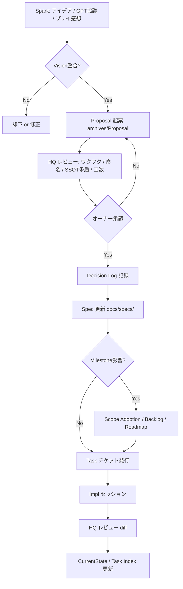

# DevelopmentHQ Operations — v1.1

**Status:** SSOT（DevelopmentHQ 承認済）  
**Version:** v1.1  
**Approved:** 2026-06-23  
**Decisions:** P2-D154〜P2-D156, **P2-D169**（設計フロー v1.1）  
**Audience:** プロジェクトオーナー / DevelopmentHQ / Implementation Agent

---

## 1. 概要

Crownfall の **DevelopmentHQ（設計・進行の司令塔）** は **Cursor** 上で運用する。

旧運用（ChatGPT ブラウザ → 報告コピペ → Claude 実装）を廃止し、**リポジトリを直接読み書きする Cursor セッション** を正とする。

| 旧 | 新 |
|---|---|
| ChatGPT = DevelopmentHQ | **Cursor HQ セッション** = DevelopmentHQ |
| Claude Code = 実装 | **Cursor Impl セッション** = 実装 |
| `■ Task:` コピペブロック | **リポジトリ更新**（Decision / spec / ダッシュボード） |
| GPT 協議 → 未反映 | **Proposal → Decision → Spec** のパイプライン必須 |

---

## 2. 役割分担

```
プロジェクトオーナー
  │ 方針承認・プレイテスト・最終 GO
  ▼
DevelopmentHQ（Cursor — HQ セッション）
  │ 設計パイプライン統括 / Scope / Decision / Task / レビュー
  ▼
Implementation Agent（Claude Code — 最大 2 並行 / worktree 推奨）
  │ 指定 Task のみ実装
  ▼
リポジトリ（SSOT）
```

---

## 3. 設計文書の種類（レイヤー）

新規アイデア・GPT 協議結果は、**いきなり spec に書かない**。レイヤーを守る。

| レイヤー | 格納先 | 役割 | 変更頻度 |
|---|---|---|---|
| **Vision** | `26_CombatVision.md` 等 | 体験の不変原則 | 極めて低い（Decision 必須） |
| **World / Lore（戦後生態系）** | `docs/specs/world/`（`00`〜`11`） | 世界観・歴史・生態の正 | Decision 後 |
| **System Spec** | `07_`〜`09_`, `08_` 等 | ゲームルール・数値・スキーマ | Task 単位で更新 |
| **Proposal** | `docs/archives/.../Proposal/` | 未承認の設計案 | レビュー中 |
| **Implementation** | `CODEMAP.md`, コード | 実装の正 | Impl Task で更新 |
| **Backlog** | `05_Backlog.md` | 名前と優先度のみ | Decision / Closeout 後 |

**GPT・口頭・チャットでの協議は SSOT にならない。** 必ず Proposal または spec 更新パイプラインを通す。

---

## 4. 設計パイプライン（標準フロー）



### 各ステップの責務

| Step | 担当 | 成果物 |
|---|---|---|
| **Spark** | オーナー / GD / GPT | メモ（SSOT 化前） |
| **Vision 整合** | HQ | Combat Vision / World Bible 原則との照合メモ |
| **Proposal** | HQ | IN/OUT scope、リスク、Task 順案、命名 |
| **HQ レビュー** | HQ | レビュー文書（例: `*_Review_v1.0.md`） |
| **オーナー承認** | オーナー | GO / 修正指示 |
| **Decision** | HQ | `03_Decision_Log.md` |
| **Spec** | HQ | `docs/specs/game/` or `implementation/` |
| **Task** | HQ | Impl チケット（Bundle 付き） |
| **Impl** | Impl | コード + 報告 |
| **HQ レビュー** | HQ | diff 確認・承認 |
| **Closeout** | HQ | Milestone 時: Completed 文書 |

### ショートカット（許可される場合）

| 条件 | 省略可 |
|---|---|
| 1 ファイル・10 行未満の typo / 参照リンク修正 | Proposal |
| 既承認 Decision の文言同期のみ | オーナー再承認 |
| Vision / Spec に既にある内容の実装のみ | 新規 Proposal（Task のみ） |

**新システム（状態異常・属性・戦闘 AI 等）はショートカット不可。**

---

## 5. 戦闘・ビルド系の設計フロー（専用）

戦闘拡張は **Combat Vision（P2-D166）** を必ず最初に読む。

```text
Combat Vision 整合チェック
  ↓
Proposal（戦闘サブシステム単位: 例「状態異常 Tier1」）
  ↓
依存確認: Affix / Skill / Enemy / UI / VFX(Phase3-A)
  ↓
段階採用（Data → Resolver → Combat → UI → Content）
  ↓
Task 分割（1 Task = 1 接続層、≤10 files）
```

**段階統合原則（Incremental Integration）:**

1. **Data** — Resource / enum 定義のみ  
2. **Resolver** — 付与・tick・解除ロジック（CombatController 等）  
3. **Combat 接続** — ダメージ・行動阻害への反映  
4. **UI** — アイコン・ログ・「見て分かる」表現  
5. **Content** — 敵・Affix・スキルへの投入  

一度に Tier 全部を実装しない。

---

## 6. セッション種別

| 種別 | 目的 | 入口 |
|---|---|---|
| **HQ / Design** | Proposal・レビュー・Decision・Scope | 本書 §4、`CurrentState.md` |
| **HQ / Review** | Impl 成果物の diff レビュー | Task 報告 + git diff |
| **Implementation** | 指定 Task の実装 | Task Bundle |
| **Content** | `.tres` 量産 | 承認済み spec |
| **Visual**（Phase3-A） | アセット（**gameplay 変更なし**） | Art Direction |

---

## 7. Task 実装フロー（既存）

1. HQ が Task チケット発行  
2. Impl セッションで実装  
3. HQ がリポジトリでレビュー（§8 チェックリスト）  
4. 合格 → ダッシュボード更新  

---

## 8. HQ レビューチェックリスト

| # | 確認 |
|---|---|
| 1 | Task スコープ・変更ファイル数 ≤ 10 |
| 2 | Decision 先行（新ルールの場合） |
| 3 | Combat Vision 不変原則を侵害していないか |
| 4 | spec / CODEMAP 整合 |
| 5 | Exit Criteria 充足 |
| 6 | 「見るだけで分かる」戦闘表現（該当時） |

---

## 9. ドキュメント更新責任

| タイミング | 更新者 | 対象 |
|---|---|---|
| Proposal 起票 | HQ | `archives/.../Proposal/` |
| 設計承認 | HQ | Decision Log + spec |
| Task 完了 | HQ | CurrentState, Task Index |
| Milestone 終了 | HQ | Closeout, Backlog 整理 |

---

## 10. Phase 順序（P2-D156 / P2-D178）

```
Phase3-A Visual Production  ← 現在（gameplay 変更なし）
  ↓
Phase3-B Content + Combat Depth
  ↓
Phase4 Polish → Phase5 Release
```

## 11. Impl 並行運用（P2-D177）

| 環境 | 推奨 |
|---|---|
| MacBook Air 16GB | Claude Code **最大 2** + Cursor HQ |
| 同一リポジトリ | **git worktree** 推奨 |
| Godot 同時起動 | Claude は 1〜2 に抑制 |

---

## 12. 参照

| 文書 | 用途 |
|---|---|
| `05_Backlog.md` | 未実装機能プール |
| `04_Development_Master_Plan.md` | マイルストーン戦略 |
| `26_CombatVision.md` | 戦闘不変原則 |
| `docs/archives/GameplayArchive/Proposal/Phase3B_Status_Element_Combat_Proposal_v1.0.md` | 状態異常・属性検討案 |

---

## 変更履歴

| 版 | 日付 | 内容 |
|---|---|---|
| v1.0 | 2026-06-23 | Cursor 移行初版 |
| v1.1 | 2026-06-23 | 設計パイプライン・戦闘設計フロー（P2-D169） |
| v1.2 | 2026-06-23 | M9 完了・Claude Code 2 並行（P2-D177）・Phase3-A 開始 |
