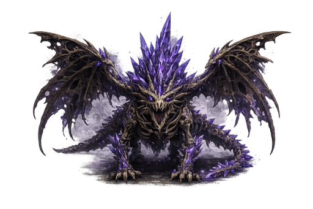
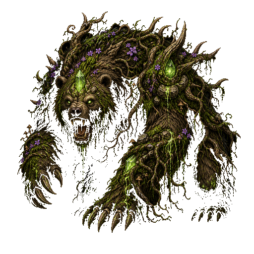
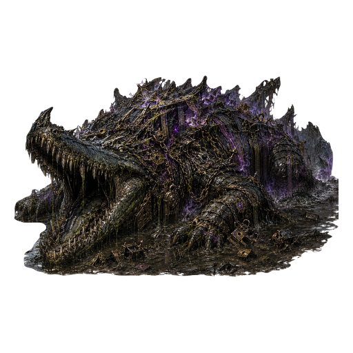
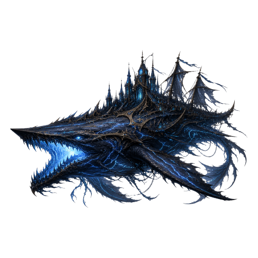
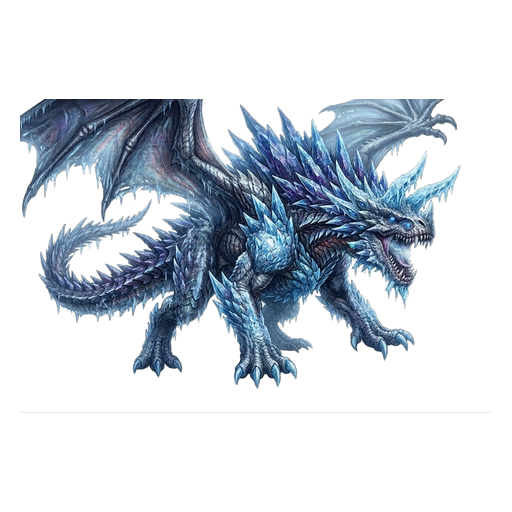
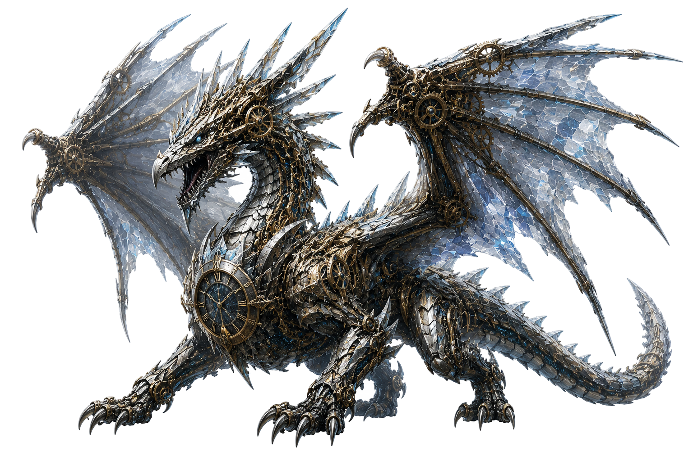
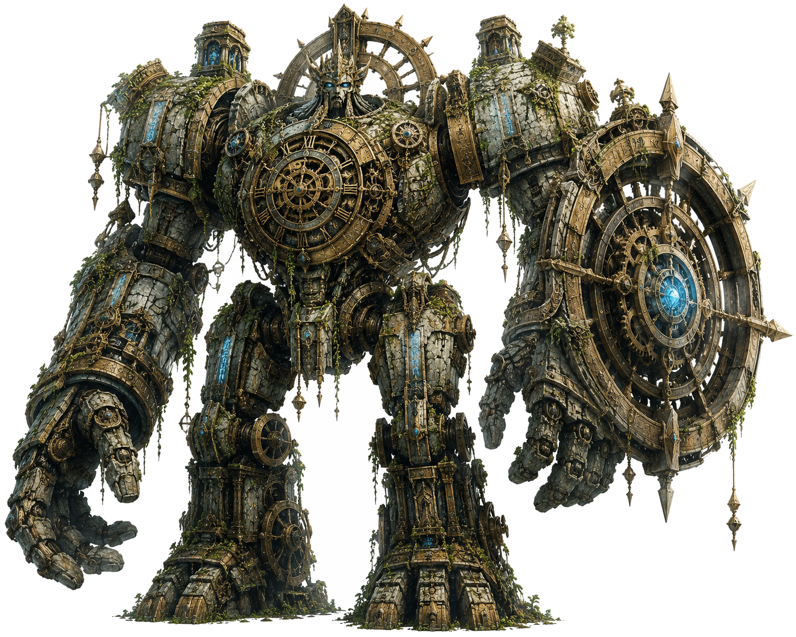

# Boss攻略まとめ

メイン①〜⑤の **×-5ボス** と、時間帯降臨ボスを横断で見るページ。章の道中は各Biome攻略へ。

## メイン5

| # | ボス | Biome | 弱点 | 耐性 | HP目安 | ATK目安 |
|---|---|---|---|---|---:|---:|
| ① | 水晶骸竜 セルディオン | モーンゲート | **電気／闇** | — | 2000 | 145 |
| ② | フローラベア グランヴェル | ウィスパーウッド | **炎** | 闇 | 2560 | 168 |
| ③ | 底なしの王 モルドガル | ミストフェン | **電気／闇** | 闇 | 2400 | 168 |
| ④ | 潮鳴王 ネレイオン | ブラックショア | **聖／氷** | **炎** | 2776 | 184 |
| ⑤ | 始祖の竜 エルディオン | フロストリッジ | **炎** | 闇／電気 | 2550 | 300 |

数値は基礎。Hard／NM・深層では別物。  
**指定召喚・開幕同席は Hard／NM のみ**（ノーマルのボス戦は本体だけ）。

---

## ① セルディオン



- **初見殺し枠。** 道中炎で来るとボスで詰みがち  
- 基礎 ATK **145**・攻撃速度 **1.1**（ノーマルでも手数がある）  
- 出血を撒く。前衛と回復を落とすな  
- 攻略詳細 →[モーンゲート](mourngate.md)

!!! tip "二属性編成"
    炎（道中）＋電気or闇（ボス）を隊に分けるのが定石。

---

## ② グランヴェル



- 道中もボスも **炎一色**で通せる甘いボス（属性的に）  
- 見た目どおり硬い。再生イメージなので火力で押し切れ  
- 出血あり。長期戦になりやすい  
- →[ウィスパーウッド](whisperwood.md)

---

## ③ モルドガル



- 弱点は **電気／闇**。影響属性は電気寄り  
- 毒持ちの沼王。DoT部屋のあとで体力削られてると事故る  
- 闇は弱点でもあり耐性でもあるデータなので、電気主軸が無難  
- →[ミストフェン](mistfen.md)

---

## ④ ネレイオン



- **炎耐性。** ②特化のまま来ると一番泣くボス  
- **聖／氷**で殴れ。道中は聖弱点が多い  
- 冷却を撒く。テンポが落ちる  
- HP厚め。長期戦装備と回復を厚く  
- →[ブラックショア](blackshore.md)

---

## ⑤ エルディオン



- 弱点は **炎**。影響属性は氷（氷シナジーもアリ）  
- 基礎 ATK **300**・攻撃速度 **1.5**。状態異常が通りにくい（耐性多め）  
- 半減時の全回復は無し。再生系の継続回復（HoT）はある  
- 防御が厚め。炉研ぎ不足がバレる  
- 闇／電気耐性。④の聖軸はここでも使えるが、炎の方が刺さる  
- クリアでメイン5ノーマル制覇 → Hard解放条件（**仲間加入は無し**・功績のみ）  
- →[フロストリッジ](frostridge.md)

---

## 属性チートシート（メインボスだけ）

```
① 電気・闇
② 炎
③ 電気（闇はデータ上弱点＆耐性の両記載あり→電気優先）
④ 聖・氷 ← 炎NG
⑤ 炎（サブ氷シナジー）
```

装備の持ち替えタイミングは④が最大の曲がり角。

---

## 時間帯降臨ボス

メイン⑤前後〜エンド想定。時刻帯のみ挑戦可。詳細は[イベント](events.md)。

| 降臨 | 時間帯（JST） | 弱点 | HP目安 | セット |
|---|---|---|---:|---|
| **時環の共鳴龍クロノス・ウェーブ** | 0/3/6/9時〜各1h | **電気／聖** | 4200 | 時環の刻 |
| **境界の番ヴァルガード** | 1/4/7/10時〜各1h | **聖／電気** | 3600 | アンティーク |

### クロノス・ウェーブ



- ラスボス級。基礎 ATK **250**・攻撃速度 **1.5**。時環共鳴・圧砕などでテンポと耐久を削ってくる  
- **クロックモス招集は無し**（本体との一騎打ち寄り）  
- 闇耐性。**電気／聖**で殴れ  
- 報酬はセット「時環の刻」（初回1個確定・再周回40%。3部位加護＝行動速度・スキル短縮）  
- →[イベント](events.md)／[モンスター](../data/monsters.md#chronos_wave)

### ヴァルガード



- 機械式ゴーレム風の擬機械体。境界廊の番人  
- **聖／電気**弱点。闇耐性  
- 報酬はセット「アンティーク」（初回1個確定・再周回40%。3部位加護＝HP・与ダメ↑／被ダメ↓）  
- →[イベント](events.md)／[モンスター](../data/monsters.md#valgard)

---

関連: [要注意敵](threats.md)／[おすすめ装備](recommended-gear.md)／[進行](progression.md)
