# UI案内（スクリーンショット付き）

「画面のどこ押せばいい？」用。画像は開発中キャプチャなので、実機のセーフエリアや数値は環境で違う。

---

## 拠点ホーム

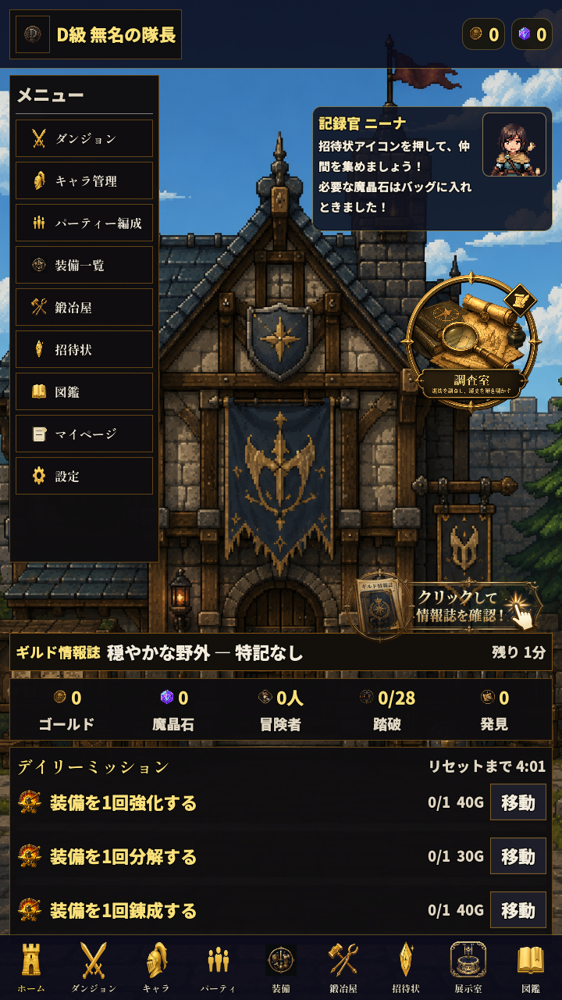{ width="320" }

押さえる場所:

| 場所 | 役割 |
|---|---|
| **左上の縦メニュー** | ダンジョン／キャラ／編成／装備／鍛冶／招待状／図鑑／マイページ／設定 |
| **上部の数値** | 左がゴールド、右が魔晶石 |
| **ニーナ** | おすすめ案内。序盤は招待状や調査室を指差してくる |
| **調査室アイコン** | 配置調査へ（図鑑・完全調査景品。②解放には不要） |
| **ギルド情報誌** | 放浪予兆・天候の効果など。バナー／建物周りから |
| **日課** | 毎日3件。報酬受け取り忘れ注意 |
| **下ナビ** | 主要画面へのショートカット（展示室もここ） |

---

## 下ナビのアイコン対応

| アイコン | 画面 |
|---|---|
| 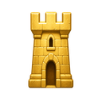{ width="40" } | ホーム |
| 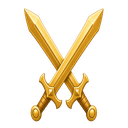{ width="40" } | ダンジョン選択 |
| 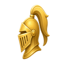{ width="40" } | キャラ管理 |
| { width="40" } | 編成 |
| 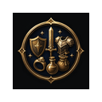{ width="40" } | 装備一覧 |
| 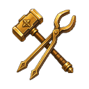{ width="40" } | 鍛冶屋 |
| 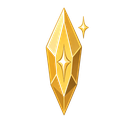{ width="40" } | 招待状 |
| 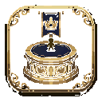{ width="40" } | 展示室 |
| 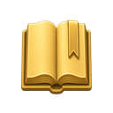{ width="40" } | 図鑑 |

---

## ダンジョン選択

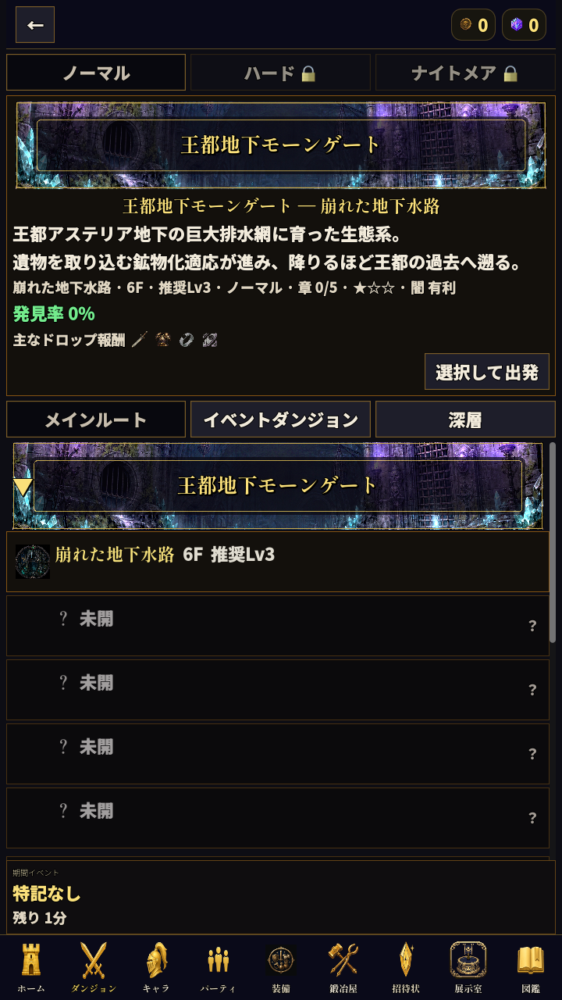{ width="320" }

| 見るところ | 意味 |
|---|---|
| **メイン／イベント／深層** | タブで切替（寄り道は出ない） |
| **ノーマル／ハード／ナイトメア** | 危険度。→[Hard/NM](hard-nightmare.md) |
| **バナーと推奨Lv** | 今の戦力と相談 |
| **章（×-1〜×-5）** | ボスは×-5 |

Biomeバナー例:

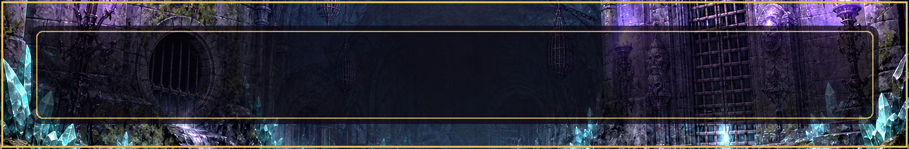{ width="200" }
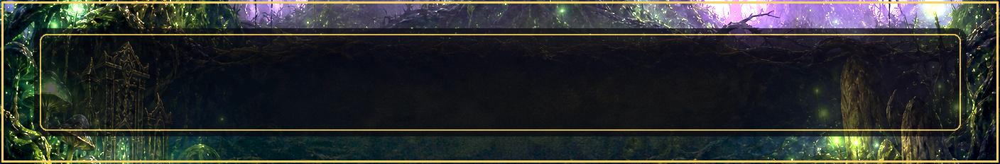{ width="200" }
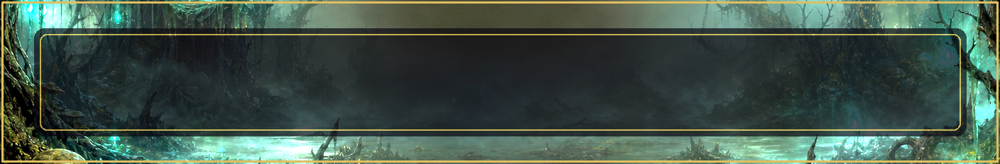{ width="200" }
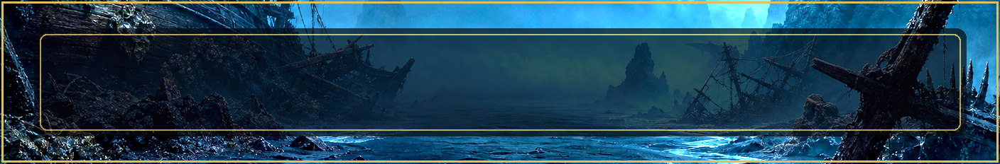{ width="200" }
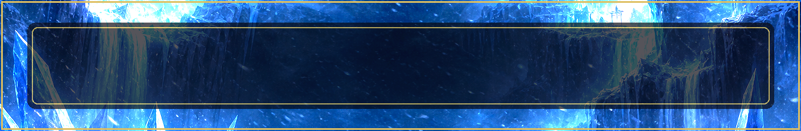{ width="200" }

---

## 招待状

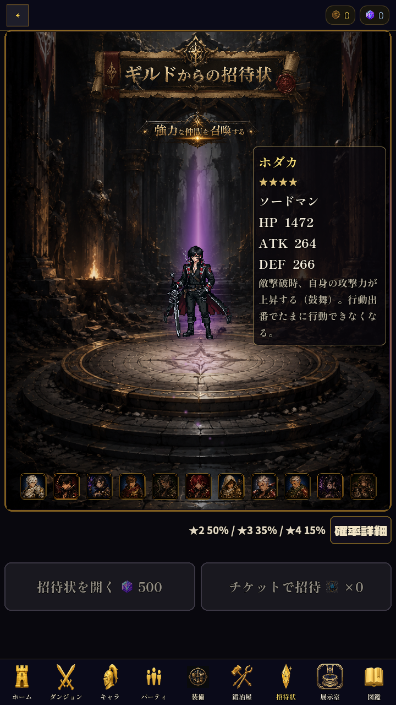{ width="320" }

| UI | 意味 |
|---|---|
| 中央の探索者 | いまフォーカス中の助っ人（プール閲覧） |
| ★2 50%／★3 35%／★4 15% | 排出率 |
| **招待状を開く（500）** | 魔晶石単発 |
| **チケットで招待** | 石を使わない |

詳細運用は[招待状ガイド](gacha.md)。

---

## 鍛冶屋

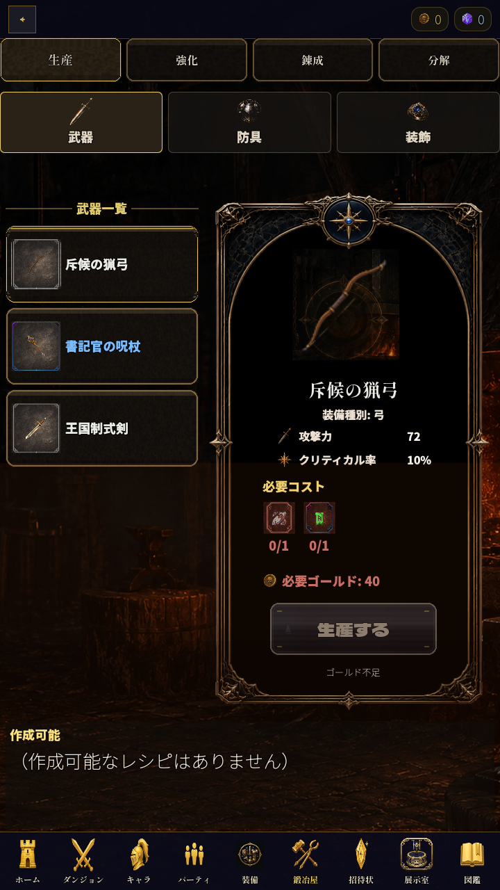{ width="320" }

タブのイメージ:

- **生産** — 作る  
- **炉研ぎ** — +強化  
- **錬成** — 装備Lv  
- **分解** — 燃料化  

必要素材はアイコン＋個数。詳しくは[装備と鍛冶](equipment.md)。

---

## 迷ったら

1. 下ナビの **ホーム** に戻る  
2. ニーナのセリフを読む（序盤はヒント）  
3. [初心者ガイド](beginner.md)／[FAQ](faq.md)

実機でノッチにUIが食い込む等があれば、設定や再起動のあと、それでもダメなら既知のレイアウト系の可能性あり。
