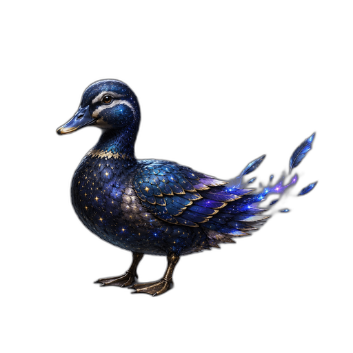
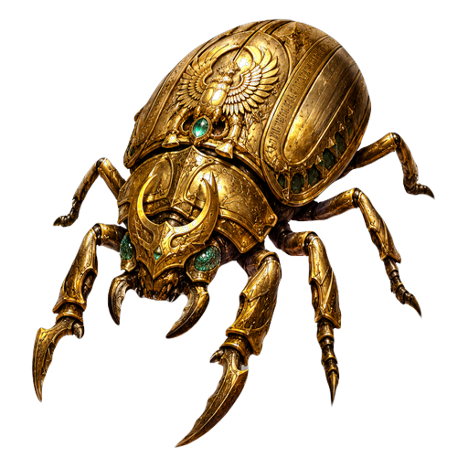
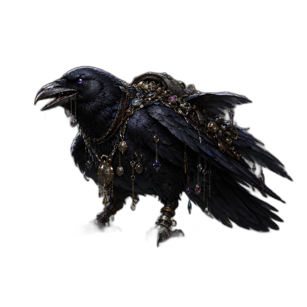
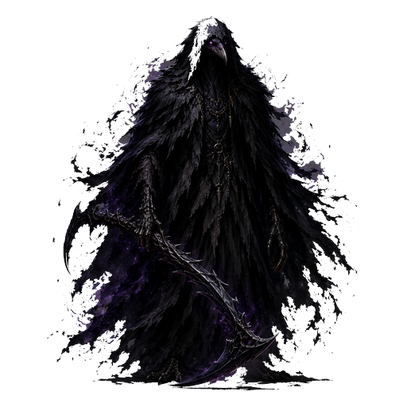

# 放浪敵一覧

メイン探索の戦闘部屋に、低確率で混ざる **遍在希少種**。  
イベントDGでは基本出ない（専任ルート側に本体がいる）。

ギルド情報誌の「◯◯出現率↑」週は、該当種が増えやすい。

---

## 早見表

| 敵 | 出現率目安（N） | 弱点 | 逃走 | 何がおいしいか |
|---|---:|---|---|---|
| **コズミックダック** | 約2.5% | 炎 | あり（短め） | 序盤から狩れる希少枠。素材・周回のアクセント |
| **ゴールデンスカラベ** | 約1.5% | 炎 | あり（短め） | ゴールド／砂金感。逃げる前に落とせ |
| **宝冠レイヴン** | 約1.5% | 電気 | なし寄り | **装備ドロップが強い**（★寄り・伝説枠あり）。神話も極低確率 |
| **影狩り** | 約0.8% | 聖 | なし寄り | **死告**武器（剣／双鎌／弓／杖）。未所持は撃破で1本確定・以降25%。**序盤①1〜3では出ない** |

Hard／NMだと出現率が上がる（レア装備倍率と同型）。合計するとノーマル帯でだいたい **数％台**のレアエンカウント。

---

## コズミックダック

- エルダ濃いところをふらつくダック  
- 弱いので見逃すと損、というより「見つけたら炎で即狩れ」  
- 月曜イベント「裂け目」の主役でもある  
- 逃げるまでが短い。ダラダラすると逃げる

---

## ゴールデンスカラベ

- 鉱脈・砂金イメージの金虫  
- 水曜イベント「砂金の巣穴」の主役  
- ダック同様に逃げやすい。発見したら優先ターゲット

---

## 宝冠レイヴン

- 装備回収向きの放浪。火曜イベントの巣でも会える  
- **電気**で狩る  
- ドロップは★2〜伝説寄り。神話は別枠でごく低確率  
- 情報誌でレイヴン週のときはメイン周回が熱い

---

## 影狩り

- 放浪のボス感。基礎ATKが異常（約295）  
- 出現前に **予兆テキスト**（死を告げる羽音…）が出ることがある  
- **聖**必須級。鈍化も撒く  
- ①の序盤章（1-1〜1-3）では出ない保護あり  
- 木曜イベント「影狩りの狩場」でも専任出現  
- **専用報酬「死告」** — 剣／双鎌／弓／杖。未所持は撃破で1本確定、所持後は25%。パッシブは通常雑魚に約15%即死（エリート／ボス／放浪は対象外）

!!! warning "影狩りに雑に突っ込むな"
    装備も編成も甘いと、希少エンカウントのはずが全滅エンカウントになる。死告目当てでも聖ゼロは事故る。

---

## 狙い方

| やり方 | コメント |
|---|---|
| メインを淡々と周回 | 合計数％なので「運」部分が大きい |
| 情報誌の予兆週 | ダック／レイヴン等が盛りやすい |
| イベント日次 | 「確実にその敵と戦う」用。放浪待ちより早い |
| Hard以上 | 出現率アップ。戦力があるなら一石二鳥 |

---

関連: [イベントDG](events.md)／[要注意敵](threats.md)／[稼ぎ方](farming.md)
